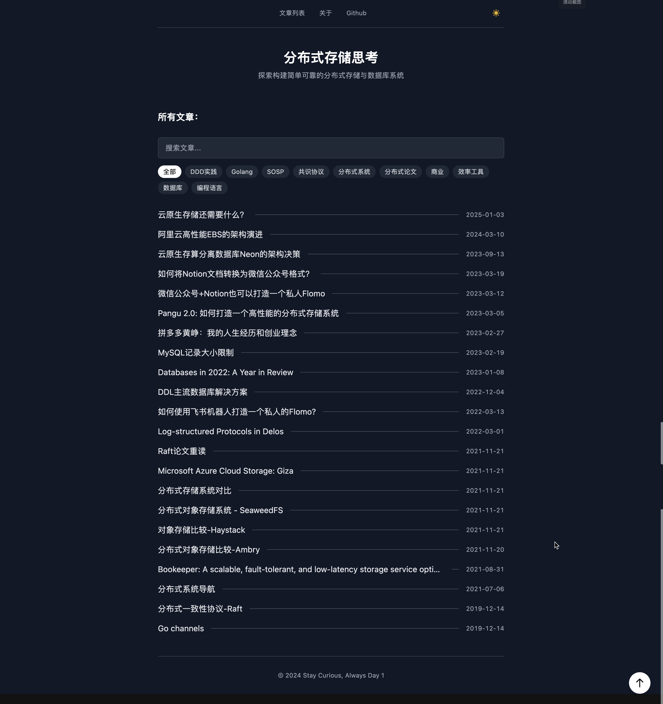
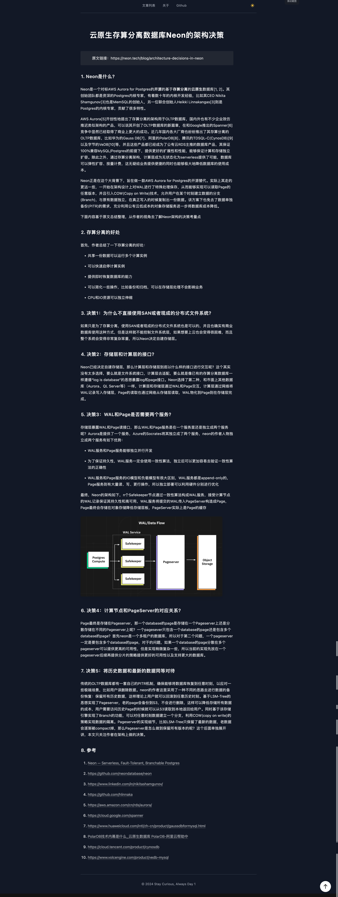

<h1 align="center">NotionP</h1>

<p align="center">
  A clean, fast Notion-powered personal blog built with Next.js 14 + TypeScript.
</p>

<p align="center">
  <a href="https://0x7c00.openhex.cn" rel="nofollow">Live Demo</a>
  ·
  <a href="./README.md">中文 README</a>
</p>

---

## Overview

NotionP is a blog template using a Notion Database as the CMS. It includes:

- Post list with search & tag filtering
- Post detail page rendered via react-notion-x
- Global dark mode
- Image proxy to mitigate Notion expiring signed URLs
- Dynamic Open Graph image for social sharing previews

## Screenshots

<table>
  <tr>
    <td align="center" valign="top" width="50%">
      <a href="./docs/screenshots/home.png"></a>
    </td>
    <td align="center" valign="top" width="50%">
      <a href="./docs/screenshots/post.png"></a>
    </td>
  </tr>
</table>

## Tech Stack

- Next.js 14 (Pages Router)
- React 18
- TypeScript
- Tailwind CSS
- react-notion-x / notion-client / notion-utils
- next-themes (dark mode)

## Quick Start (Local)

```bash
npm install
```

Create a local env file:

```bash
cp .env.local.example .env.local
```

Fill in:

```bash
NOTION_SECRET_KEY=secret_xxx
```

Start dev server:

```bash
npm run dev
```

Default URL:

- http://localhost:3000 (if occupied, it will try 3001/3002...)

## Configuration

Site configuration lives in [site.config.ts](./site.config.ts):

- `rootDatabaseId`: Notion Database ID (post source)
- `name` / `domain` / `author` / `description`
- `navigationLinks`: top navigation

## Notion Database Schema

NotionP expects these properties (case-sensitive):

- `Name`: title
- `Abstract`: summary (optional)
- `Tags`: tags (Multi-select, optional)

It uses Notion `created_time` as the primary sorting key (newest first).

## Deploy

### One-click deploy (Vercel)

[](https://vercel.com/new/git/external?repository-url=https://github.com/KDF5000/NotionP&project-name=notionp&repository-name=notionp)

Required env vars:

- `NOTION_SECRET_KEY`

### Manual deploy (Recommended)

1. Fork this repo
2. Create a Notion Integration and copy the Secret Key  
   https://www.notion.so/my-integrations
3. Add the Integration to your Notion Database page (Connections)
4. Update `rootDatabaseId` in [site.config.ts](./site.config.ts)
5. Import the repo in Vercel and set `NOTION_SECRET_KEY`

## FAQ

### 1) Terminal keeps showing /_next/static/chunks/*.js 404

This is usually caused by stale dev assets or port switching. Try:

```bash
rm -rf .next
npm run dev
```

Then hard refresh the browser (Cmd+Shift+R).

### 2) Notion images sometimes break

Some Notion image URLs are signed and expire. This project uses `/api/image` as a proxy with caching to reduce broken images.

## License

MIT
